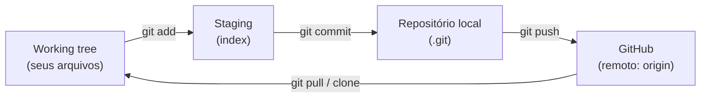
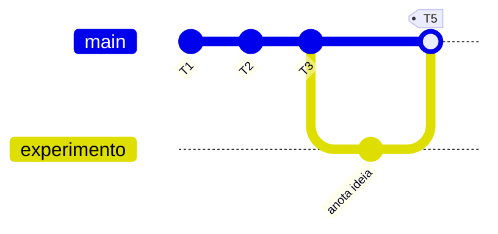

# Lab 00 — Git, GitHub e gh

:::info[Por que este é o Lab 00]
Toda entrega do curso é feita **por commit**: cada tarefa avaliada vira **um commit** cuja mensagem começa com `Tn:`, e o autograder corrige exatamente o estado daquele commit. Portanto, antes de piscar um LED, você precisa dominar a ferramenta de entrega. Nesta aula você aprende **git** (versionamento local), **GitHub** (o remoto da organização) e **gh** (o GitHub CLI, que faz PRs, issues e releases sem sair do terminal) — praticando **no próprio repositório da aula**.
:::

## Objetivos de aprendizagem

Ao final você será capaz de:

- Explicar o modelo do git: **working tree → staging → repositório local → remoto**.
- Configurar sua identidade e um `.gitignore` correto para projetos PlatformIO.
- Aplicar a convenção do curso: **1 tarefa = 1 commit**, mensagem iniciando com `Tn:`.
- Criar branches, fazer merge e resolver um conflito simples.
- Autenticar o `gh` e usar `gh repo`, `gh pr`, `gh issue`, `gh release` e `gh api`.
- Versionar um firmware ESP32 real e garantir que ele **compila no CI**.
- Publicar um **release** — o mesmo mecanismo usado em tarefas de deploy nas próximas aulas.

## Material

- **VS Code** com a extensão **PlatformIO IDE**.
- **git** instalado (`git --version`).
- **GitHub CLI (`gh`)** instalado (`gh --version`) — série 2.x.
- Conta no GitHub, **membro da organização** `ELT85B-N21-2026-2`.
- Seu repositório de grupo: `lab00-grupo-<sua-letra>` (criado a partir de `lab00-template`).

:::note[Sobre o hardware]
Este laboratório é sobre **ferramentas**, não sobre periféricos. O único circuito é um **LED simples** no Wokwi, usado apenas para você praticar o commit de firmware real e a compilação no CI. Nas próximas aulas o circuito cresce; o fluxo de entrega que você aprende aqui permanece idêntico.
:::

## O modelo mental do git



Um **commit** é uma fotografia imutável do projeto num instante, com autor, data e mensagem. O `git add` escolhe _o que_ entra na foto; o `git commit` tira a foto; o `git push` envia as fotos para o GitHub, onde o autograder as encontra.

:::tip[A convenção do curso]
Cada tarefa `Tn` = **um commit** cuja mensagem começa com `Tn:`. Exemplo: `T1: configura identidade do git`. Se precisar corrigir uma tarefa, **refaça** com um novo commit `Tn:` — vale sempre o `Tn:` **mais recente**. Nunca use `push --force` no repositório de grupo.
:::

---

## Setup

### 1. Instalar as ferramentas

<Tabs groupId="os">
  <TabItem value="linux" label="Linux (Debian/Ubuntu/WSL)">

```bash title="Terminal"
sudo apt update && sudo apt install -y git
# GitHub CLI (repositório oficial):
sudo mkdir -p -m 755 /etc/apt/keyrings
wget -qO- https://cli.github.com/packages/githubcli-archive-keyring.gpg \
  | sudo tee /etc/apt/keyrings/githubcli-archive-keyring.gpg > /dev/null
echo "deb [arch=$(dpkg --print-architecture) signed-by=/etc/apt/keyrings/githubcli-archive-keyring.gpg] https://cli.github.com/packages stable main" \
  | sudo tee /etc/apt/sources.list.d/github-cli.list > /dev/null
sudo apt update && sudo apt install -y gh
```

  </TabItem>
  <TabItem value="mac" label="macOS">

```bash title="Terminal"
brew install git gh
```

  </TabItem>
  <TabItem value="win" label="Windows" default>

```powershell title="PowerShell"
winget install --id Git.Git -e
winget install --id GitHub.cli -e
```

:::tip
No Windows, recomenda-se o **WSL2** para uma experiência de terminal mais próxima do Linux. Se usar WSL, siga a aba Linux dentro do WSL.
:::

  </TabItem>
</Tabs>

Confirme as versões (a saída exata varia; o importante é _não dar erro_):

```bash title="Terminal — saída esperada (exemplo)"
$ git --version
git version 2.4x.x
$ gh --version
gh version 2.9x.x (2026-xx-xx)
```

### 2. Configurar sua identidade

O git carimba **autor** em cada commit. Use o **mesmo e-mail da sua conta GitHub** (o do domínio institucional), senão os commits não aparecem vinculados a você.

```bash title="Terminal"
git config --global user.name  "Seu Nome Completo"
git config --global user.email "seu.email@alunos.utfpr.edu.br"
git config --global init.defaultBranch main
git config --global pull.rebase false
```

### 3. Autenticar o `gh`

```bash title="Terminal"
gh auth login
```

Responda aos prompts: **GitHub.com** → **HTTPS** → _authenticate Git with your GitHub credentials?_ **Yes** → **Login with a web browser**. Cole o código de 8 dígitos no navegador. Ao final, o `gh` também configura o git para usar suas credenciais nos `push`/`pull`.

```bash title="Terminal — saída esperada"
$ gh auth status
github.com
  ✓ Logged in to github.com account seu-usuario (keyring)
  - Active account: true
  - Git operations protocol: https
```

### 4. Obter o repositório de grupo

Seu professor cria `lab00-grupo-<letra>` a partir de `lab00-template`. Clone com o `gh` (ele resolve a URL da organização para você):

```bash title="Terminal"
gh repo clone ELT85B-N21-2026-2/lab00-grupo-a
cd lab00-grupo-a
```

:::warning[Trabalhe sempre dentro do repositório clonado]
Todos os comandos abaixo assumem que você está **dentro** da pasta do repositório de grupo. Confira com `git status` antes de começar.
:::

---

## Parte 1 — Primeiro commit e identidade

**Objetivo:** provar que sua identidade está correta e fazer seu primeiro commit seguindo a convenção.

Muitos passos desta aula são **de runtime** (rodam comandos, não editam código). Para que o autograder possa checá-los, você salva a **evidência** da saída em `evidencias/*.txt`. Crie a pasta:

```bash title="Terminal"
mkdir -p evidencias
git config --list | grep -E "user\.(name|email)" > evidencias/git-config.txt
cat evidencias/git-config.txt
```

```text title="evidencias/git-config.txt — saída esperada"
user.name=Seu Nome Completo
user.email=seu.email@alunos.utfpr.edu.br
```

Agora faça o commit **T1** — note a mensagem começando com `T1:`:

```bash title="Terminal"
git add evidencias/git-config.txt
git commit -m "T1: registra identidade do git"
```

<CommitPoint
  task="Salvar evidencias/git-config.txt com user.name e user.email configurados"
  pontos={6}
  files="evidencias/git-config.txt"
/>

Em seguida, apresente-se ao grupo criando um `sobre.md` na raiz:

```markdown title="sobre.md"
# Sobre o grupo

- **Grupo:** A
- **Integrantes:** Fulano da Silva (RA 000000), Ciclana Souza (RA 111111)
- **Usuários GitHub:** @fulano, @ciclana
```

```bash title="Terminal"
git add sobre.md
git commit -m "T2: adiciona apresentacao do grupo"
```

<CommitPoint
  task="Criar sobre.md com integrantes e usuarios do grupo"
  pontos={6}
  files="sobre.md"
/>

:::info[`setup()` vs `loop()` — a mesma ideia no git]
No firmware, código que roda **uma vez** vai no `setup()`; código **contínuo** vai no `loop()`. No git há um paralelo: `git config --global` (identidade) é um **setup** que você faz **uma vez por máquina**; `git add`/`commit`/`push` é o **loop** de trabalho que você repete a cada tarefa.
:::

---

## Parte 2 — Fluxo de trabalho e histórico

**Objetivo:** entender staging vs commit e produzir um histórico limpo.

### 2.1 O `.gitignore` do PlatformIO

Artefatos de build **não** entram no git. Sem isso, você versionaria centenas de megabytes de binários e quebraria o CI. Crie o arquivo:

```gitignore title=".gitignore"
# PlatformIO
.pio/
# VS Code (opcional — mantém .vscode/extensions.json se quiser)
.vscode/
!.vscode/extensions.json
# Sistema
.DS_Store
```

```bash title="Terminal"
git add .gitignore
git commit -m "T3: ignora artefatos do PlatformIO"
```

<CommitPoint
  task="Adicionar .gitignore que ignora a pasta de build do PlatformIO"
  pontos={6}
  files=".gitignore"
/>

:::warning[`.pio/` já rastreado?]
Se você compilar **antes** de criar o `.gitignore`, o git pode já estar rastreando `.pio/`. Para parar de rastrear sem apagar do disco: `git rm -r --cached .pio` e então faça o commit.
:::

### 2.2 Lendo o histórico

```bash title="Terminal"
git log --oneline --decorate > evidencias/git-log.txt
cat evidencias/git-log.txt
```

```text title="evidencias/git-log.txt — saída esperada (hashes variam)"
b3a1f2c (HEAD -> main) T3: ignora artefatos do PlatformIO
9d4e0aa T2: adiciona apresentacao do grupo
1c77b21 T1: registra identidade do git
```

```bash title="Terminal"
git add evidencias/git-log.txt
git commit -m "T4: registra historico com a convencao Tn"
```

<CommitPoint
  task="Salvar evidencias/git-log.txt mostrando commits com o prefixo Tn"
  pontos={6}
  files="evidencias/git-log.txt"
/>

---

## Parte 3 — Branches e merge

**Objetivo:** isolar trabalho em um branch e integrá-lo à `main`.



```bash title="Terminal"
git switch -c experimento
echo "Ideia: medir tempo de piscada do LED." > notas.md
git add notas.md
git commit -m "wip: rascunho de ideia no branch experimento"

git switch main
git merge experimento
git branch --all > evidencias/git-branch.txt
git commit -am "T5: integra branch experimento na main"
```

:::note[Por que `commit -am` funciona aqui]
O `merge` já criou um commit de merge; o `-am` do último comando registra o `evidencias/git-branch.txt` (arquivo já rastreado? use `git add` antes se for novo). Confira com `git status` — o objetivo é que exista um commit **T5:** com o branch integrado e a evidência salva.
:::

<CommitPoint
  task="Criar branch, fazer merge e salvar evidencias/git-branch.txt"
  pontos={8}
  files="evidencias/git-branch.txt"
/>

---

## Parte 4 — GitHub pelo terminal (`gh`)

**Objetivo:** operar o repositório remoto sem abrir o navegador.

### 4.1 Autenticação (evidência)

```bash title="Terminal"
gh auth status 2> evidencias/gh-auth.txt
cat evidencias/gh-auth.txt
git add evidencias/gh-auth.txt
git commit -m "T6: comprova autenticacao do gh"
```

<CommitPoint
  task="Salvar evidencias/gh-auth.txt comprovando login no github.com"
  pontos={6}
  files="evidencias/gh-auth.txt"
/>

### 4.2 Inspecionar o repositório

```bash title="Terminal"
gh repo view --json name,owner,defaultBranchRef \
  --jq '"repo=\(.owner.login)/\(.name) branch=\(.defaultBranchRef.name)"' \
  > evidencias/gh-repo.txt
cat evidencias/gh-repo.txt
git add evidencias/gh-repo.txt
git commit -m "T7: inspeciona o repositorio com gh"
```

```text title="evidencias/gh-repo.txt — saída esperada"
repo=ELT85B-N21-2026-2/lab00-grupo-a branch=main
```

<CommitPoint
  task="Salvar evidencias/gh-repo.txt com owner, nome do repo e branch padrao"
  pontos={6}
  files="evidencias/gh-repo.txt"
/>

:::tip[`git push` de verdade]
Até aqui os commits estão só no seu repositório local. Envie-os agora: `git push`. Confira no GitHub (ou com `gh repo view --web`) que os commits `T1`…`T7` chegaram.
:::

---

## Parte 5 — Firmware real que compila no CI

**Objetivo:** versionar um projeto PlatformIO que **compila** — o autograder roda `pio run` neste commit.

O template já traz `platformio.ini`, `diagram.json` e `wokwi.toml`. Crie o firmware:

```cpp title="src/main.cpp"
#include <Arduino.h>

const int LED = 2;  // GPIO2 (LED da placa na maioria dos DevKits ESP32)

void setup() {
  Serial.begin(115200);
  pinMode(LED, OUTPUT);
  Serial.println("lab00: git + github + gh");  // roda UMA vez
}

void loop() {
  digitalWrite(LED, HIGH);
  delay(500);
  digitalWrite(LED, LOW);
  delay(500);                                   // repete PARA SEMPRE
}
```

Compile e simule:

```bash title="Terminal"
pio run
# Depois: paleta de comandos do VS Code -> "Wokwi: Start Simulator"
```

:::tip[Preveja antes de rodar]
Antes de simular, responda: qual é o **período** completo de uma piscada (aceso + apagado)? E a **frequência** em Hz? Confira na simulação observando o LED e o log serial.
:::

```bash title="Terminal"
git add src/main.cpp
git commit -m "T8: firmware blink que compila"
git push
```

<CommitPoint
  task="Implementar src/main.cpp (blink) que compila com pio run"
  pontos={10}
  files="src/main.cpp platformio.ini"
/>

---

## Projeto integrador — do commit ao release

**Objetivo:** juntar tudo: um Pull Request revisável e um Release publicado.

### PR — propor mudança via branch

```bash title="Terminal"
git switch -c feature/frequencia
# ajuste o delay para piscar mais rápido (ex.: 200 ms) em src/main.cpp
git commit -am "wip: piscada mais rapida"
git push -u origin feature/frequencia

gh pr create --base main --head feature/frequencia \
  --title "T9: ajusta frequencia da piscada" \
  --body "Reduz o delay para 200 ms. Fecha a tarefa T9." \
  > evidencias/gh-pr.txt
cat evidencias/gh-pr.txt   # imprime a URL do PR
```

Volte para a `main`, incorpore o PR e registre a evidência:

```bash title="Terminal"
gh pr merge --merge --delete-branch
git switch main
git pull
git add evidencias/gh-pr.txt
git commit -m "T9: registra o pull request criado"
git push
```

<CommitPoint
  task="Abrir um pull request com gh e salvar a URL em evidencias/gh-pr.txt"
  pontos={6}
  files="evidencias/gh-pr.txt"
/>

### README — documentar a entrega

````markdown title="README.md"
# lab00 — grupo A

Firmware de demonstração (blink) usado para praticar o fluxo git + GitHub + gh.

## Como compilar

```bash
pio run
```

## Histórico

Cada tarefa T1…Tn corresponde a um commit com prefixo `Tn:`.
````

```bash title="Terminal"
git add README.md
git commit -m "T10: documenta o projeto no README"
git push
```

<CommitPoint
  task="Escrever README.md descrevendo compilacao e a convencao de commits"
  pontos={12}
  files="README.md src/main.cpp"
/>

### Release — publicar uma versão

O mesmo `release` que sustenta as tarefas de deploy das próximas aulas:

```bash title="Terminal"
git tag -a v1.0.0 -m "Lab 00 concluido"
git push origin v1.0.0
gh release create v1.0.0 \
  --title "Lab 00 — v1.0.0" \
  --notes "Entrega do fluxo git + GitHub + gh."
```

Registre um commit-marcador (sem alterar arquivos) para o autograder ancorar a tarefa:

```bash title="Terminal"
git commit --allow-empty -m "T11: publica release v1.0.0"
git push
```

<CommitPoint
  task="Publicar o release v1.0.0 com gh release create"
  pontos={8}
  type="release"
  allowEmpty
  push
  id="release"
/>

---

## Desafios

:::warning[Valem pontos e reforçam o fluxo]
Cada desafio é **uma tarefa** = um commit `Tn:`. Salve a evidência pedida.
:::

### D1 — Desfazer com segurança

Você percebeu que um commit ficou errado, mas ele **já foi enviado**. Reescrever histórico público é proibido no repo de grupo. Use `git revert`, que cria um **novo** commit desfazendo o anterior:

```bash title="Terminal"
git revert --no-edit HEAD~1   # ou o hash do commit a reverter
git log --oneline -3 > evidencias/git-revert.txt
git commit -am "T12: reverte commit com git revert"
git push
```

<CommitPoint
  task="Usar git revert e salvar evidencias/git-revert.txt mostrando o commit de reversao"
  pontos={5}
  files="evidencias/git-revert.txt"
/>

### D2 — Resolver um conflito de merge

Crie um conflito proposital e resolva-o. Em dois branches, edite a **mesma linha** de `conflito.txt`, faça merge, e edite o arquivo mantendo as duas informações (sem os marcadores `<<<<<<<`):

```bash title="Terminal"
git switch -c ladoA; echo "cor do LED: vermelho" > conflito.txt
git add conflito.txt; git commit -m "wip: ladoA"
git switch main; git switch -c ladoB; echo "cor do LED: verde" > conflito.txt
git add conflito.txt; git commit -m "wip: ladoB"
git switch main; git merge ladoA; git merge ladoB   # conflito aqui
# edite conflito.txt para: "cor do LED: vermelho e verde" e remova os marcadores
git add conflito.txt; git commit -m "T13: resolve conflito de merge"
git push
```

<CommitPoint
  task="Provocar e resolver um conflito de merge, mantendo as duas versoes em conflito.txt"
  pontos={5}
  files="conflito.txt"
/>

### D3 — Uma issue pelo terminal

```bash title="Terminal"
gh issue create --title "Ajustar cor do LED no diagram.json" \
  --body "O LED deveria ser verde." > evidencias/gh-issue.txt
gh issue list > evidencias/gh-issue-list.txt
git add evidencias/gh-issue.txt evidencias/gh-issue-list.txt
git commit -m "T14: cria issue com gh"
git push
```

<CommitPoint
  task="Abrir uma issue com gh e salvar a URL em evidencias/gh-issue.txt"
  pontos={5}
  files="evidencias/gh-issue.txt"
/>

### D4 — `gh api`: falar direto com a API

O `gh api` chama a REST/GraphQL do GitHub autenticado. Confirme, via API, que seu release existe:

```bash title="Terminal"
gh api repos/{owner}/{repo}/releases/tags/v1.0.0 --jq '.tag_name' \
  > evidencias/gh-api.txt
cat evidencias/gh-api.txt   # deve imprimir: v1.0.0
git add evidencias/gh-api.txt
git commit -m "T15: consulta o release via gh api"
git push
```

<CommitPoint
  task="Usar gh api para confirmar a tag do release e salvar evidencias/gh-api.txt"
  pontos={5}
  files="evidencias/gh-api.txt"
/>

---

## Gabarito

:::danger[Spoiler]
Tente sozinho antes de abrir. Copiar sem entender vai te penalizar nas próximas aulas, quando o fluxo for pré-requisito.

<details>
<summary>Comandos de referência (T1…T15)</summary>

```bash title="Referência — sequência completa"
# T1
git config --global user.name "Nome"; git config --global user.email "email@dominio"
mkdir -p evidencias
git config --list | grep -E "user\.(name|email)" > evidencias/git-config.txt
git add evidencias/git-config.txt && git commit -m "T1: registra identidade do git"

# T2
printf "# Sobre o grupo\n\n- Grupo: A\n" > sobre.md
git add sobre.md && git commit -m "T2: adiciona apresentacao do grupo"

# T3
printf ".pio/\n.vscode/\n.DS_Store\n" > .gitignore
git add .gitignore && git commit -m "T3: ignora artefatos do PlatformIO"

# T4
git log --oneline --decorate > evidencias/git-log.txt
git add evidencias/git-log.txt && git commit -m "T4: registra historico com a convencao Tn"

# T5
git switch -c experimento && echo "ideia" > notas.md
git add notas.md && git commit -m "wip: ideia"
git switch main && git merge experimento
git branch --all > evidencias/git-branch.txt
git add evidencias/git-branch.txt && git commit -m "T5: integra branch experimento na main"

# T6 / T7
gh auth status 2> evidencias/gh-auth.txt
git add evidencias/gh-auth.txt && git commit -m "T6: comprova autenticacao do gh"
gh repo view --json name,owner,defaultBranchRef \
  --jq '"repo=\(.owner.login)/\(.name) branch=\(.defaultBranchRef.name)"' > evidencias/gh-repo.txt
git add evidencias/gh-repo.txt && git commit -m "T7: inspeciona o repositorio com gh"

# T8: criar src/main.cpp (blink) -> pio run -> commit "T8: firmware blink que compila"
# T9: gh pr create ... > evidencias/gh-pr.txt -> commit "T9: registra o pull request criado"
# T10: README.md -> commit "T10: documenta o projeto no README"

# T11
git tag -a v1.0.0 -m "Lab 00 concluido" && git push origin v1.0.0
gh release create v1.0.0 --title "Lab 00 — v1.0.0" --notes "Entrega."
git commit --allow-empty -m "T11: publica release v1.0.0"

# T12: git revert --no-edit HEAD~1 -> evidencias/git-revert.txt -> "T12: ..."
# T13: conflito.txt resolvido -> "T13: resolve conflito de merge"
# T14: gh issue create ... > evidencias/gh-issue.txt -> "T14: cria issue com gh"
# T15: gh api repos/{owner}/{repo}/releases/tags/v1.0.0 --jq '.tag_name' > evidencias/gh-api.txt
```

</details>
:::

---

## Checklist de entrega

- [ ] `git config` com **nome e e-mail institucional** corretos (T1).
- [ ] Commits com prefixo `Tn:` na ordem T1…T15.
- [ ] `.gitignore` ignora `.pio/` e o build **não** foi commitado (T3).
- [ ] `src/main.cpp` **compila** (`pio run` sem erro) (T8).
- [ ] Tudo enviado com `git push`; nada de `push --force`.
- [ ] Release `v1.0.0` publicado e visível em `gh release list` (T11).
- [ ] Evidências presentes em `evidencias/` para os passos de runtime.

:::info[Pontuação]
Total: **100 pts** (o autograder normaliza para 0–10). Base T1…T11 = 80 pts; Desafios T12…T15 = 20 pts.
:::
