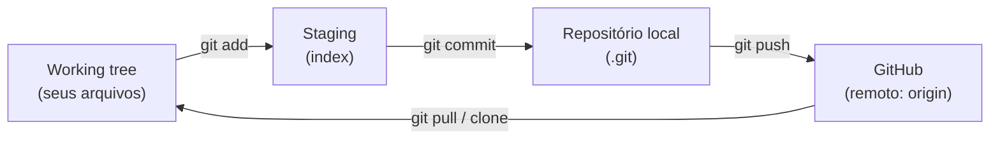
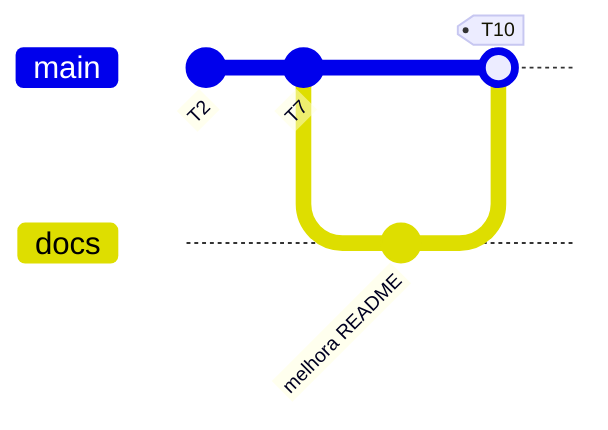

# Lab 00 — Git, GitHub e gh

import {
  LabSetup,
  LabLogout,
} from "@site/src/components/shared/InstructionsSite";

<LabSetup /> {/* no topo, no lugar do :::info[Antes de começar] */}

---

<LabLogout /> {/* no fim, no lugar do :::warning[Ao terminar] */}

---

Toda entrega do curso é feita **por commit**: cada tarefa avaliada vira **um commit** cuja mensagem começa com `Tn:`, e o autograder corrige exatamente o estado daquele commit. Antes de tudo, você precisa dominar a ferramenta de entrega. Neste Lab 00 você aprende **git** (versionamento local), **GitHub** (o remoto da organização), **gh** (o GitHub CLI) e **Markdown** — a linguagem em que se escreve todo `README.md`, issue e pull request do curso.

## Clone o repositório inicial do LAB00

Escolha o Grupo e entre com o comando abaixo para criar o repositório no GitHub:

<LabTeamMembers labName="lab00" />

## Envie o link do repositório do seu grupo no Moodle:

<LabSubmit labName="lab00" />

---

## Objetivos de aprendizagem

Ao final você será capaz de:

- Explicar o modelo do git: **working tree → staging → repositório local → remoto**.
- Aplicar a convenção do curso: **1 tarefa = 1 commit**, mensagem iniciando com `Tn:`.
- Escrever **Markdown** com fluência: cabeçalhos, ênfase, listas, links, imagens, código, tabelas, citações e sumário com âncoras.
- Produzir um `README.md` completo, legível e navegável.
- Criar branches, fazer merge e resolver um conflito simples.
- Usar `gh` para `repo`, `pr`, `issue`, `release` e `api` sem sair do terminal.

## Material

- **VS Code** (editor). Recomendada a extensão **Markdown All in One** e o **markdownlint** para pré-visualizar e revisar o Markdown.
- **git** instalado (`git --version`).
- **GitHub CLI (`gh`)** instalado (`gh --version`) — série 2.x.
- Conta no GitHub, **membro da organização** `ELT85B-N21-2026-2`.
- Seu repositório de grupo: `lab00-grupo-<sua-letra>` (criado no passo acima).

:::tip[Pré-visualize enquanto escreve]
No VS Code, com um arquivo `.md` aberto, use **Ctrl+Shift+V** (ou o ícone de lupa no canto superior direito) para ver o Markdown renderizado lado a lado. É a forma mais rápida de conferir cada tarefa antes do commit.
:::

## O modelo mental do git



Um **commit** é uma fotografia imutável do projeto num instante, com autor, data e mensagem. O `git add` escolhe _o que_ entra na foto; o `git commit` tira a foto; o `git push` envia as fotos para o GitHub, onde o autograder as encontra.

:::tip[A convenção do curso]
Cada tarefa `Tn` = **um commit** cuja mensagem começa com `Tn:`. Exemplo: `T1: registra identidade do git`. Se precisar corrigir uma tarefa, **refaça** com um novo commit `Tn:` — vale sempre o `Tn:` **mais recente**. Nunca use `push --force` no repositório de grupo.
:::

:::info[Configuração única vs. rotina de trabalho]
Há dois ritmos no git. `git config --global` (sua identidade) é feito **uma única vez por máquina** — configura e esquece. Já `git add` → `commit` → `push` é a **rotina** que você repete a cada tarefa. Não confunda os dois: reconfigurar identidade a cada commit é desperdício; esquecer de commitar/enviar é perder a entrega.
:::

Confira que você está **dentro** do repositório clonado antes de começar:

```bash title="Terminal"
cd lab00-grupo-a   # troque pela letra do seu grupo
git status
```

---

## Parte 1 — Primeiro commit e o título do README

**Objetivo:** provar que sua identidade está correta e criar o `README.md` com um cabeçalho de nível 1.

Muitos passos desta aula são **de runtime** (rodam comandos, não editam arquivos "de conteúdo"). Para que o autograder possa checá-los, você salva a **evidência** da saída em `evidencias/*.txt`. Crie a pasta e registre a identidade:

```bash title="Terminal"
mkdir -p evidencias
git config --list | grep -E "user\.(name|email)" > evidencias/git-config.txt
cat evidencias/git-config.txt
git add evidencias/git-config.txt
git commit -m "T1: registra identidade do git"
```

<CommitPoint
  task="Salvar evidencias/git-config.txt com user.name e user.email configurados"
  pontos={5}
  files="evidencias/git-config.txt"
/>

O `#` no início de uma linha é um **cabeçalho H1** — o título do documento. Crie o `README.md` com o título e um parágrafo de introdução:

```markdown title="README.md"
# lab00 — grupo A

Repositório do grupo A para o Lab 00 (git, GitHub, gh e Markdown).
```

```bash title="Terminal"
git add README.md
git commit -m "T2: cria README com titulo e introducao"
```

<CommitPoint
  task="Criar README.md com um cabecalho H1 e um paragrafo de introducao"
  pontos={5}
  files="README.md"
/>

---

## Parte 2 — Markdown essencial

**Objetivo:** os blocos de construção de qualquer texto em Markdown.

### 2.1 Cabeçalhos e ênfase

O número de `#` define o nível do cabeçalho (H1 a H6). Para ênfase: `**negrito**`, `*itálico*` e `` `código inline` `` (crases).

```markdown title="README.md (adicione ao final)"
## Sobre o grupo

Integrantes: **Fulano da Silva** e _Ciclana Souza_.
Usamos o comando `git status` o tempo todo.

### Contato

Dúvidas: abra uma _issue_ neste repositório.
```

**Resultado renderizado** — os `#` viram títulos de tamanhos diferentes, `**...**` fica em negrito, `*...*` em itálico e `` `...` `` aparece em fonte monoespaçada.

```bash title="Terminal"
git add README.md
git commit -m "T3: adiciona cabecalhos e enfase ao README"
```

<CommitPoint
  task="Adicionar cabecalhos H2/H3, negrito, italico e codigo inline ao README.md"
  pontos={6}
  files="README.md"
/>

### 2.2 Listas

Três tipos: não-ordenada (`-`), ordenada (`1.`) e **de tarefas** (`- [ ]` / `- [x]`). A indentação cria sublistas.

```markdown title="README.md (adicione ao final)"
## Ferramentas

- git
- GitHub CLI (gh)
  - `gh pr`
  - `gh issue`
- VS Code

## Passos para entregar

1. Editar o arquivo
2. `git add`
3. `git commit`

## Checklist

- [x] Repositório clonado
- [ ] README completo
```

```bash title="Terminal"
git add README.md
git commit -m "T4: adiciona listas ao README"
```

<CommitPoint
  task="Adicionar lista nao-ordenada com sublista, lista ordenada e lista de tarefas ao README.md"
  pontos={6}
  files="README.md"
/>

### 2.3 Links e imagens

Link: `[texto](url)`. Imagem: `` — a **imagem é um link com `!` na frente**. Um _badge_ é só uma imagem cuja URL gera o selo.

```markdown title="README.md (adicione ao final)"
## Referências

- [Documentação oficial do Git](https://git-scm.com/doc)
- [Manual do GitHub CLI](https://cli.github.com/manual/)


```

```bash title="Terminal"
git add README.md
git commit -m "T5: adiciona links e um badge ao README"
```

<CommitPoint
  task="Adicionar ao menos dois links e uma imagem (badge) ao README.md"
  pontos={5}
  files="README.md"
/>

---

## Parte 3 — Markdown para documentação técnica

**Objetivo:** os recursos que tornam um `README` realmente útil.

### 3.1 Blocos de código

Três crases abrem e fecham um bloco; a palavra após as crases define a **linguagem** (destaque de sintaxe). Isso é essencial para instruções de terminal.

````markdown title="README.md (adicione ao final)"
## Como usar

Clone e entre na pasta:

```bash
git clone https://github.com/ELT85B-N21-2026-2/lab00-grupo-a.git
cd lab00-grupo-a
```
````

:::tip[Bloco dentro de bloco]
Para _mostrar_ um bloco de código dentro de outro (como acima), o bloco externo usa **quatro crases**. Você raramente precisa disso — mas é útil ao documentar Markdown.
:::

```bash title="Terminal"
git add README.md
git commit -m "T6: adiciona bloco de codigo com destaque de linguagem"
```

<CommitPoint
  task="Adicionar um bloco de codigo com identificacao de linguagem (ex. bash) ao README.md"
  pontos={5}
  files="README.md"
/>

### 3.2 Tabelas

Colunas separadas por `|`; a segunda linha (`---`) separa o cabeçalho e define o alinhamento (`:---`, `:---:`, `---:`).

```markdown title="README.md (adicione ao final)"
## Comandos essenciais

| Comando      | O que faz                    |
| :----------- | :--------------------------- |
| `git status` | mostra o estado da árvore    |
| `git add`    | move mudanças para o staging |
| `git commit` | grava um commit              |
```

**Resultado renderizado:**

| Comando      | O que faz                    |
| :----------- | :--------------------------- |
| `git status` | mostra o estado da árvore    |
| `git add`    | move mudanças para o staging |
| `git commit` | grava um commit              |

```bash title="Terminal"
git add README.md
git commit -m "T7: adiciona uma tabela ao README"
```

<CommitPoint
  task="Adicionar uma tabela Markdown com cabecalho e ao menos duas linhas ao README.md"
  pontos={5}
  files="README.md"
/>

### 3.3 Citações e regra horizontal

`>` cria uma **citação**; três hífens (`---`) numa linha isolada criam uma **régua horizontal** que separa seções.

```markdown title="README.md (adicione ao final)"
---

> Versione cedo, versione com frequência.

Este repositório segue a convenção `Tn:` de commits do curso.
```

```bash title="Terminal"
git add README.md
git commit -m "T8: adiciona citacao e regra horizontal"
```

<CommitPoint
  task="Adicionar uma citacao e uma regra horizontal ao README.md"
  pontos={5}
  files="README.md"
/>

---

## Parte 4 — Fluxo de trabalho no git

**Objetivo:** ignorar o que não deve ser versionado e integrar trabalho por branches.

### 4.1 O `.gitignore`

Nem tudo entra no git: arquivos temporários do sistema e do editor devem ser ignorados. Crie:

```gitignore title=".gitignore"
# Sistema operacional
.DS_Store
Thumbs.db
# Temporários
*.tmp
*.log
# VS Code (mantém apenas as extensões recomendadas)
.vscode/*
!.vscode/extensions.json
```

```bash title="Terminal"
git add .gitignore
git commit -m "T9: adiciona .gitignore"
```

<CommitPoint
  task="Adicionar um .gitignore que ignora arquivos temporarios e de sistema"
  pontos={5}
  files=".gitignore"
/>

### 4.2 Branch e merge



Isole uma mudança num branch, integre-a à `main` e salve a evidência:

```bash title="Terminal"
git switch -c docs
echo "" >> README.md
echo "## Licença" >> README.md
echo "Uso educacional — ELT85B." >> README.md
git commit -am "wip: secao de licenca no branch docs"

git switch main
git merge docs
git branch --all > evidencias/git-branch.txt
git add evidencias/git-branch.txt
git commit -m "T10: integra branch docs na main"
```

<CommitPoint
  task="Criar branch, fazer merge na main e salvar evidencias/git-branch.txt"
  pontos={8}
  files="evidencias/git-branch.txt"
/>

---

## Parte 5 — GitHub pelo terminal (`gh`)

**Objetivo:** operar o repositório remoto sem abrir o navegador.

```bash title="Terminal"
gh auth status 2> evidencias/gh-auth.txt
gh repo view --json name,owner,defaultBranchRef \
  --jq '"repo=\(.owner.login)/\(.name) branch=\(.defaultBranchRef.name)"' \
  > evidencias/gh-repo.txt
cat evidencias/gh-auth.txt evidencias/gh-repo.txt
git add evidencias/gh-auth.txt evidencias/gh-repo.txt
git commit -m "T11: comprova auth e inspeciona o repo com gh"
```

```text title="evidencias/gh-repo.txt — saída esperada"
repo=ELT85B-N21-2026-2/lab00-grupo-a branch=main
```

<CommitPoint
  task="Salvar evidencias/gh-auth.txt (login) e evidencias/gh-repo.txt (owner/nome/branch)"
  pontos={5}
  files="evidencias/gh-auth.txt evidencias/gh-repo.txt"
/>

:::tip[`git push` de verdade]
Até aqui os commits estão no seu repositório local. Envie-os: `git push`. Confira no GitHub (ou com `gh repo view --web`) que os commits `T1`…`T11` chegaram.
:::

---

## Projeto integrador — o README completo

**Objetivo:** juntar todos os elementos num `README.md` bem estruturado, com **sumário navegável**.

Um bom README começa com um **sumário** (lista de links para âncoras). A âncora de um cabeçalho é o texto em minúsculas, com espaços virando hífens: `## Como usar` vira o link `[Como usar](#como-usar)`.

```markdown title="README.md — estrutura final sugerida"
# lab00 — grupo A

Repositório do grupo A para o Lab 00.

## Sumário

- [Sobre o grupo](#sobre-o-grupo)
- [Ferramentas](#ferramentas)
- [Como usar](#como-usar)
- [Comandos essenciais](#comandos-essenciais)
- [Licença](#licença)

## Sobre o grupo

...
```

Revise o `README.md` para que ele contenha, de forma coerente: título (H1), sumário com âncoras, e seções usando cabeçalhos, listas, links, um badge, um bloco de código e uma tabela.

```bash title="Terminal"
git add README.md
git commit -m "T12: monta o README final com sumario e ancoras"
git push
```

<CommitPoint
  task="Montar o README.md final com sumario de ancoras e todas as secoes integradas"
  pontos={12}
  files="README.md"
/>

### Release — publicar uma versão

O mesmo `release` que sustenta as tarefas de deploy das próximas aulas:

```bash title="Terminal"
git tag -a v1.0.0 -m "Lab 00 concluido"
git push origin v1.0.0
gh release create v1.0.0 \
  --title "Lab 00 — v1.0.0" \
  --notes "README em Markdown concluido."
git commit --allow-empty -m "T13: publica release v1.0.0"
git push
```

<CommitPoint
  task="Publicar o release v1.0.0 com gh release create"
  pontos={8}
  type="release"
  allowEmpty
  push
  id="release"
/>

---

## Desafios

:::warning[Valem pontos e reforçam o fluxo]
Cada desafio é **uma tarefa** = um commit `Tn:`. Salve a evidência pedida.
:::

### D1 — Melhoria via Pull Request

Proponha uma melhoria no README por um branch e um PR, em vez de commitar direto na `main`:

```bash title="Terminal"
git switch -c feature/emojis
echo "" >> README.md
echo "## Status" >> README.md
echo "Projeto concluido. :rocket:" >> README.md
git commit -am "wip: secao de status"
git push -u origin feature/emojis

gh pr create --base main --head feature/emojis \
  --title "T14: adiciona secao de status ao README" \
  --body "Nova secao Status. Fecha a tarefa T14." \
  > evidencias/gh-pr.txt
gh pr merge --merge --delete-branch
git switch main && git pull
git add evidencias/gh-pr.txt
git commit -m "T14: registra o pull request criado"
git push
```

<CommitPoint
  task="Abrir um pull request com gh e salvar a URL em evidencias/gh-pr.txt"
  pontos={5}
  files="evidencias/gh-pr.txt"
/>

### D2 — Uma issue pelo terminal

```bash title="Terminal"
gh issue create --title "Adicionar screenshots ao README" \
  --body "O README ficaria mais claro com imagens." > evidencias/gh-issue.txt
gh issue list > evidencias/gh-issue-list.txt
git add evidencias/gh-issue.txt evidencias/gh-issue-list.txt
git commit -m "T15: cria issue com gh"
git push
```

<CommitPoint
  task="Abrir uma issue com gh e salvar a URL em evidencias/gh-issue.txt"
  pontos={5}
  files="evidencias/gh-issue.txt"
/>

### D3 — Resolver um conflito de merge

Crie um conflito proposital em `conflito.txt` e resolva-o, mantendo as duas informações (sem os marcadores `<<<<<<<`):

```bash title="Terminal"
git switch -c ladoA; echo "estilo do README: minimalista" > conflito.txt
git add conflito.txt; git commit -m "wip: ladoA"
git switch main; git switch -c ladoB; echo "estilo do README: detalhado" > conflito.txt
git add conflito.txt; git commit -m "wip: ladoB"
git switch main; git merge ladoA; git merge ladoB   # conflito aqui
# edite conflito.txt para: "estilo do README: minimalista e detalhado" e remova os marcadores
git add conflito.txt; git commit -m "T16: resolve conflito de merge"
git push
```

<CommitPoint
  task="Provocar e resolver um conflito de merge, mantendo as duas versoes em conflito.txt"
  pontos={5}
  files="conflito.txt"
/>

### D4 — `gh api`: falar direto com a API

O `gh api` chama a REST/GraphQL do GitHub autenticado. Confirme, via API, que seu release existe:

```bash title="Terminal"
gh api repos/{owner}/{repo}/releases/tags/v1.0.0 --jq '.tag_name' \
  > evidencias/gh-api.txt
cat evidencias/gh-api.txt   # deve imprimir: v1.0.0
git add evidencias/gh-api.txt
git commit -m "T17: consulta o release via gh api"
git push
```

<CommitPoint
  task="Usar gh api para confirmar a tag do release e salvar evidencias/gh-api.txt"
  pontos={5}
  files="evidencias/gh-api.txt"
/>

---

## Gabarito

:::danger[Spoiler]
Tente sozinho antes de abrir. O Markdown e o fluxo git/gh desta aula são pré-requisito de todas as próximas.

<details>
<summary>Sintaxe Markdown de referência</summary>

```markdown title="Referência — sintaxe Markdown"
# H1 ## H2 ### H3

**negrito** _italico_ `codigo inline`

- item (lista nao-ordenada)

1. item (lista ordenada)

- [ ] tarefa - [x] feita

[texto](https://url) (link)
 (imagem / badge)

​`bash
git status
​`

| A   | B   | (tabela) |
| --- | --- | -------- |
| 1   | 2   |

> citacao
> --- (regra horizontal)

[Ir para secao](#como-usar) (ancora: minusculas, espacos viram hifen)
```

</details>

<details>
<summary>Comandos de referência (T1…T17)</summary>

```bash title="Referência — sequência completa"
# T1  identidade
mkdir -p evidencias
git config --list | grep -E "user\.(name|email)" > evidencias/git-config.txt
git add evidencias/git-config.txt && git commit -m "T1: registra identidade do git"

# T2..T8  edicoes no README.md (titulo, enfase, listas, links, codigo, tabela, citacao)
#   cada bloco -> git add README.md && git commit -m "Tn: ..."

# T9  .gitignore
git add .gitignore && git commit -m "T9: adiciona .gitignore"

# T10 branch + merge
git switch -c docs && echo "## Licenca" >> README.md
git commit -am "wip: licenca"
git switch main && git merge docs
git branch --all > evidencias/git-branch.txt
git add evidencias/git-branch.txt && git commit -m "T10: integra branch docs na main"

# T11 gh auth + repo view
gh auth status 2> evidencias/gh-auth.txt
gh repo view --json name,owner,defaultBranchRef \
  --jq '"repo=\(.owner.login)/\(.name) branch=\(.defaultBranchRef.name)"' > evidencias/gh-repo.txt
git add evidencias/gh-auth.txt evidencias/gh-repo.txt
git commit -m "T11: comprova auth e inspeciona o repo com gh"

# T12 README final -> "T12: monta o README final com sumario e ancoras"
# T13 release
git tag -a v1.0.0 -m "Lab 00 concluido" && git push origin v1.0.0
gh release create v1.0.0 --title "Lab 00 — v1.0.0" --notes "Concluido."
git commit --allow-empty -m "T13: publica release v1.0.0"

# T14 gh pr create ... > evidencias/gh-pr.txt   -> "T14: ..."
# T15 gh issue create ... > evidencias/gh-issue.txt -> "T15: ..."
# T16 conflito.txt resolvido -> "T16: resolve conflito de merge"
# T17 gh api repos/{owner}/{repo}/releases/tags/v1.0.0 --jq '.tag_name' > evidencias/gh-api.txt
```

</details>
:::

---

## Checklist de entrega

- [ ] `git config` com **nome e e-mail institucional** corretos (T1).
- [ ] Commits com prefixo `Tn:` na ordem T1…T17.
- [ ] `README.md` com título, sumário de âncoras, listas, links, badge, bloco de código e tabela (T2–T8, T12).
- [ ] `.gitignore` presente (T9).
- [ ] Tudo enviado com `git push`; nada de `push --force`.
- [ ] Release `v1.0.0` publicado e visível em `gh release list` (T13).
- [ ] Evidências presentes em `evidencias/` para os passos de runtime.

:::info[Pontuação]
Total: **100 pts** (o autograder normaliza para 0–10). Base T1…T13 = 80 pts; Desafios T14…T17 = 20 pts.
:::
